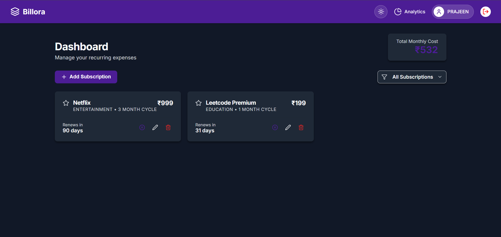
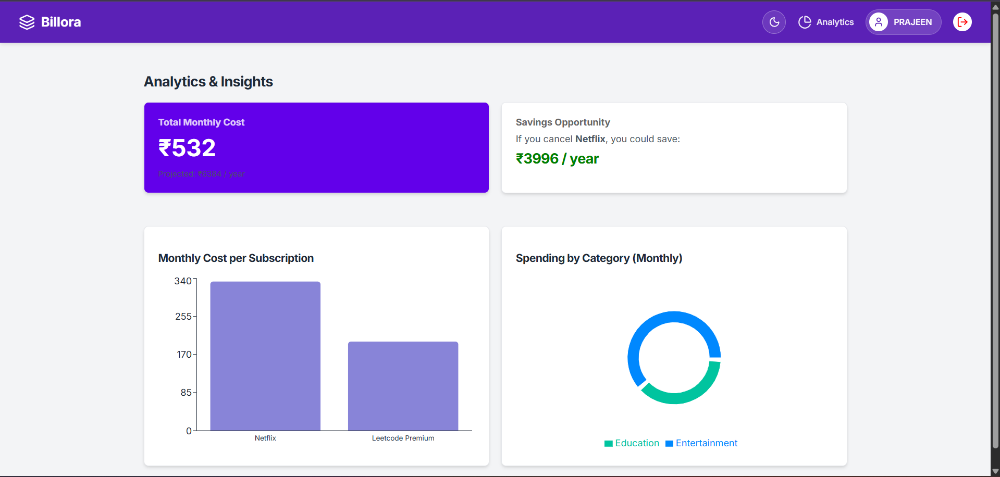

# 💸 Billora - Subscription Management App

**Billora** is a full-stack MERN application designed to help users track recurring expenses, manage subscriptions, and visualize spending habits with insightful analytics.

🔗 **Live Demo:** [https://billora-app-five.vercel.app/](https://billora-app-five.vercel.app/)
📂 **GitHub Repo:** [https://github.com/PRAJEENS2024/Billora-App](https://github.com/PRAJEENS2024/Billora-App)




---

## 🚀 Key Features

* **📊 Smart Dashboard:** View all active subscriptions and automatically calculate **Total Monthly Costs** (₹).
* **📈 Analytics:** Visual breakdowns of spending by category (Pie Chart) and individual costs (Bar Chart).
* **⏸️ Pause/Resume:** Temporarily pause subscriptions to exclude them from monthly totals without deleting them.
* **🌗 Dark/Light Mode:** Fully responsive theme toggle for day and night usage.
* **🔒 Authentication:** Secure User Registration & Login using **JWT (JSON Web Tokens)**.
* **📱 Responsive Design:** Optimized for Desktops, Tablets, and Mobile devices.

---

## 🛠️ Tech Stack

* **Frontend:** React.js, Recharts (for charts), Lucide-React (icons), CSS3.
* **Backend:** Node.js, Express.js.
* **Database:** MongoDB Atlas (Cloud).
* **Deployment:** Vercel (Frontend), Render (Backend).

---

## ⚙️ Environment Variables

To run this project locally, you will need to add the following environment variables to your `.env` file in the `backend` folder:

`MONGO_URI` - Your MongoDB Connection String
`JWT_SECRET` - A secret key for signing tokens (e.g., `supersecretkey123`)
`PORT` - 5000

---

## 📦 Installation & Setup

Follow these steps to run the project locally:

### 1. Clone the Repository
```bash
git clone https://github.com/PRAJEENS2024/Billora-App.git
cd Billora-App
```

### 2. Backend Setup

```bash
cd backend
npm install
# Create your .env file here with MONGO_URI and JWT_SECRET
node server.js

```

### 3. Frontend Setup

Open a new terminal:

```bash
cd client
npm install
npm start


```